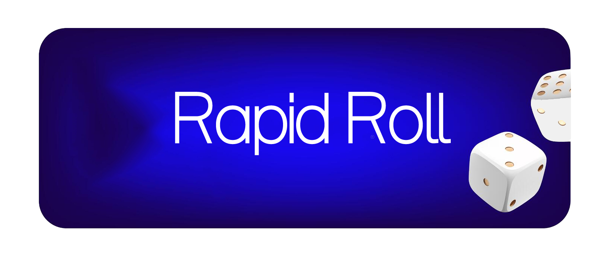

# Rapid Roll 
Welcome to the Rapid-Roll repository! 

## Objective
This project is a fun and interactive game built with ReactJS to demonstrate use of Event Listeners in React, React State, Conditional Rendering in React, React Hooks(useEffect), etc.

## Requirements
- ReactJS
- create-react-app
- Figma Design Template
- Event Listeners in React
- React State
- Conditional Rendering in React
- React Hooks(useEffect)
- github-pages

## Screenshots

## Installation
To get started, you'll need to have Node.js and npm (Node Package Manager) installed on your computer.

- Clone this repository to your local machine using git clone  
- Navigate to the cloned directory using cd 
- Run npm install to install the dependencies
- Run npm start to start the development server and visit http://localhost:3000 to view the app in your browser

## Optimizations
- Put real dots on the dice
- Save user's best rolls to localStorage
- Track the time it took to win
- Save user's best time to localStorage

## Contributing
Please feel free to fork this repository and submit pull requests with any improvements or suggestions you may have.
